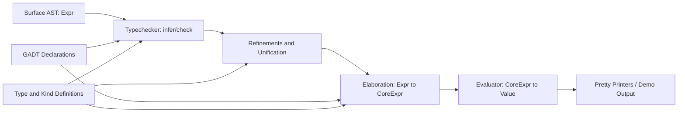
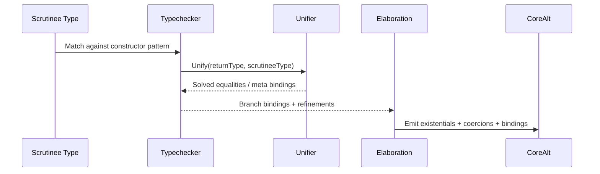
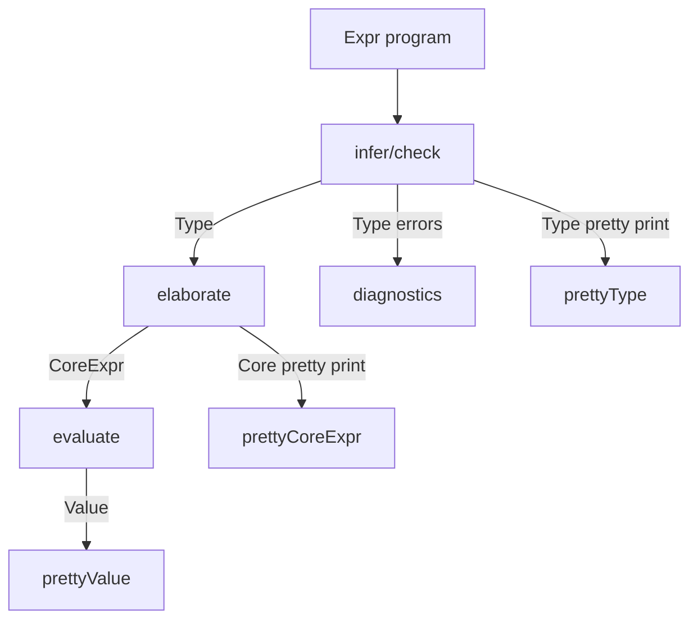

# GADT Compiler Architecture Guide

## What This Software Is

This project is a small TypeScript compiler pipeline for a GADT-based language.
It supports:

- Surface expressions and patterns
- Type inference and checking with GADT refinement
- Unification with occurs-check and zonking
- Elaboration into a Core IR with explicit type-equality evidence
- Evaluation of Core IR
- Pretty-printing for diagnostics and demo output

The code is intentionally compact and educational: each file roughly owns one stage.

---

## Inputs and Outputs

## Inputs

At runtime (demo path), the primary input is an in-memory surface AST expression plus GADT declarations.

- Surface program values: `Expr` nodes from `src/ast.ts`
- GADT declarations: `GADTDeclaration` values from `src/gadt.ts`
- Initial type environment: `TypeEnv` from `src/typechecker.ts`

In practical terms, `src/main.ts` constructs sample AST terms and declarations directly in code.

## Outputs

The pipeline produces multiple output forms at different stages:

1. Inferred surface types (`Type`)
2. Core IR (`CoreExpr`) with explicit coercion evidence
3. Runtime values (`Value`) after evaluation
4. Human-readable text from pretty printers (`prettyType`, `prettyCoreExpr`, `prettyValue`, etc.)
5. Diagnostics (thrown errors) for type/runtime failures

---

## High-Level Pipeline

---

## Module Responsibilities and Core Data Structures

## `src/ast.ts` - Surface syntax

Main structures:

- `Expr` tagged union: literals, vars, lambdas, application, let, annotation, constructors, match, if, type abstraction/application
- `Pattern` tagged union: wildcard, variable, literal, constructor pattern
- `MatchBranch`: `pattern`, optional `guard`, `body`, optional checker-produced `refinements`

Purpose:

- Represents the source-level language before elaboration

## `src/types.ts` - Types and kinds

Main structures:

- `Type` tagged union (`Var`, `Constructor`, `Arrow`, `Forall`, `Exists`, `App`, `Rigid`, `Meta`, `Refined`)
- `Kind` tagged union (`Star`, `Arrow`, `Constraint`)
- `TypeEquality` (`lhs`, `rhs`)
- Smart constructors (`tVar`, `tCon`, `tArrow`, `tForall`, etc.)

Purpose:

- Shared type/kind vocabulary for every stage

## `src/gadt.ts` - GADT declaration model

Main structures:

- `GADTDeclaration`, `GADTTypeParam`, `GADTConstructor`

Key helpers:

- `gadtDeclaration(...)` builds declarations and synthesizes declaration kind
- `extractRefinements(...)` derives equalities from match context
- `instantiateConstructor(...)` substitutes constructor schemes
- `applySubstitution(...)` substitutes type variables recursively

Purpose:

- Encodes constructor signatures and refinement metadata

## `src/typechecker.ts` - Inference/checking and refinement

Main structures:

- `TypeEnv` with:
  - term variables
  - registered GADTs
  - constructor map
  - active refinements
  - rigid vars in scope

Key APIs:

- `infer(env, expr)`
- `check(env, expr, expected)`
- `registerGADT(env, decl)`
- `checkExhaustiveness(env, scrutineeTy, branches)`

Purpose:

- Enforces typing rules and uses constructor matches to refine local types

## `src/unification.ts` - Constraint solving

Main structures:

- `UnificationError`, `OccursCheckError`

Key APIs:

- `unify(lhs, rhs)`
- `zonk(ty)`
- `applyRefinements(equalities)`
- `tryUnify(lhs, rhs)`
- `prettyType(ty)`

Purpose:

- Solves type equalities, tracks metavariable bindings, prevents infinite types

## `src/ir.ts` - Core IR and coercions

Main structures:

- `CoreExpr` tagged union (including `CoreCase`, `CoreCast`, `CoreTyLam`, `CoreTyApp`)
- `CoreAlt` for case alternatives
- `Coercion` tagged union (`CoRefl`, `CoSym`, `CoTrans`, `CoArrow`, `CoApp`, `CoForall`, `CoAxiom`, `CoVar`)

Purpose:

- A lower-level explicit representation used by evaluator and pretty printers

## `src/elaboration.ts` - Surface-to-Core lowering

Key API:

- `elaborate(env, expr): CoreExpr`

Purpose:

- Translates source constructs to Core
- Makes GADT evidence explicit in `CoreCase` alternatives through generated coercions

## `src/eval.ts` - Core evaluator

Main structures:

- `Value` tagged union (`VLit`, `VClosure`, `VTyClosure`, `VConstruct`)
- `ValueEnv` map

Key APIs:

- `evaluate(env, coreExpr)`
- `prettyValue(value)`

Purpose:

- Executes Core IR; type/coercion evidence is erased at runtime

## `src/prettyprint.ts` - Human-readable rendering

Key APIs:

- `prettyKind`, `prettyGADT`, `prettyCoreExpr`, `prettyCoercion`

Purpose:

- Produces readable diagnostics and demo output

## `src/main.ts` - End-to-end demo driver

Purpose:

- Builds sample GADTs/programs
- Runs type inference, elaboration, evaluation, and pretty printing
- Demonstrates success cases and expected type errors

---

## Core Algorithms

## 1. Type inference and checking

Strategy:

- Structural recursion over `Expr`
- For unknowns, create `Meta` variables
- Constrain types using `unify`
- For `let`, infer/check bound value then generalize free metas into `forall`
- For variable lookup, instantiate schemes (`forall`) with fresh metas

Why it matters:

- Gives principal-ish polymorphic behavior over this toy language

## 2. Unification with occurs-check

Strategy:

- Recursively unify shapes (`Constructor`, `Arrow`, `App`, etc.)
- If either side is a `Meta`, bind it unless occurs-check fails
- Normalize through `zonk` to chase bound metas

Why it matters:

- This is the constraint-solving backbone for inference and refinement

## 3. GADT pattern refinement

Strategy:

- When matching constructor `C` against scrutinee type `T idx...`:
  - instantiate constructor type variables
  - unify constructor return type with scrutinee type
  - extract equalities between indices
  - extend branch environment with these equalities and pattern bindings

Why it matters:

- Branch-local equalities are what make GADT pattern matching precise

## 4. Exhaustiveness/redundancy analysis

Strategy:

- Identify candidate constructors for the scrutinee's GADT
- Track which constructors are covered by explicit branches
- Treat wildcard and variable patterns as catch-all
- Mark duplicate/covered constructor branches as redundant

Why it matters:

- Provides useful static feedback about match completeness and dead branches

## 5. Elaboration to Core IR

Strategy:

- Rewrite each surface node to an explicit Core form
- For constructor matches, build `CoreAlt` nodes carrying:
  - existential binders
  - coercion evidence from index equalities and constructor constraints
  - field bindings

Why it matters:

- Makes implicit type reasoning explicit in IR, simplifying downstream interpretation

## 6. Runtime evaluation

Strategy:

- Standard environment-based interpreter:
  - lambdas become closures
  - applications substitute by environment extension
  - type abstractions are erased via `VTyClosure`
  - `CoreCast` coercions are erased

Why it matters:

- Confirms elaborated programs execute with expected value behavior

---

## How Refinement Information Flows

---

## End-to-End Dataflow (Concrete Artifacts)

---

## Practical Entry Points

- Build: `npm run build`
- Tests: `npm test`
- Demo smoke: `npm run test:demo`
- Run demo: `npm run start`

---

## Final Mental Model

Think of the project as three layers:

1. Static meaning: AST + types + GADT declarations + typechecker + unification
2. Explicit core meaning: elaboration into a Core IR with coercion evidence
3. Dynamic meaning: evaluation of Core IR to runtime values

The first layer proves programs are meaningful, the second makes reasoning explicit, and the third executes the result.
